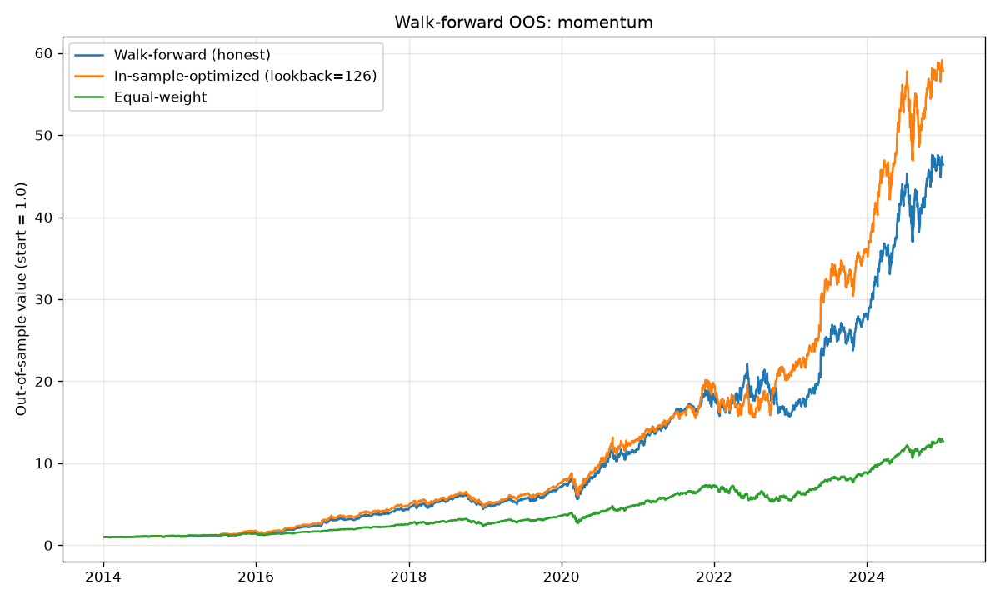
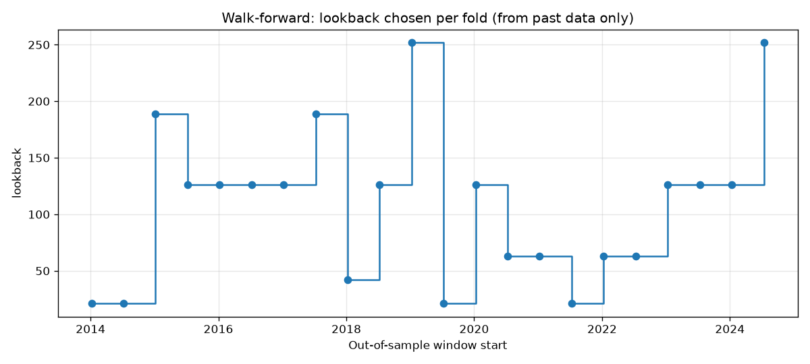
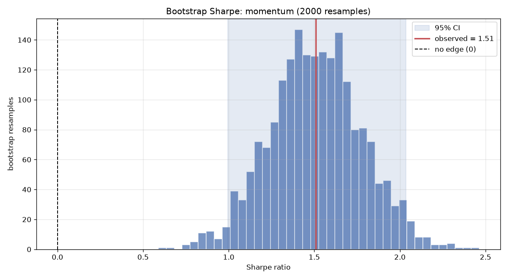
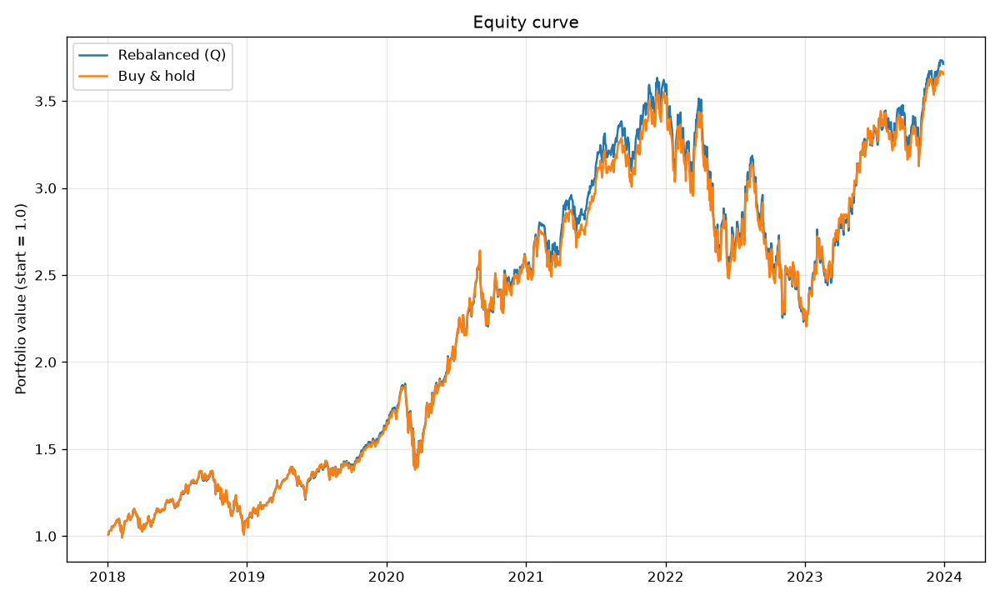
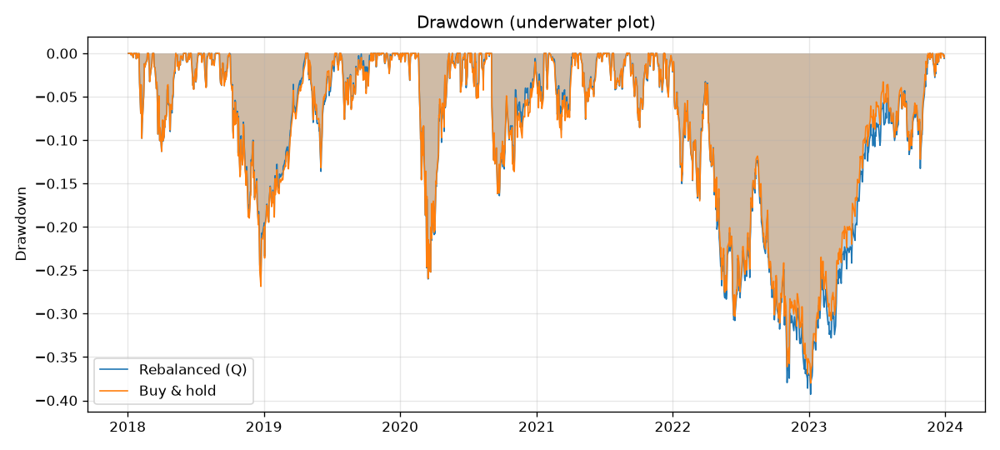

# Backtester

A small, honest portfolio **backtester**. Give it a basket of tickers and target
weights, and it simulates actually *holding* that portfolio through history —
rebalancing on a schedule and paying transaction costs on every trade — then
reports the performance you'd really have earned.

Where [`portfolio-lab`](../portfolio-lab) finds the best allocation for a single
period, this project asks the follow-up question: **what happens when you live
with an allocation over time?** Weights drift with the market, rebalancing pulls
them back, and trading isn't free.

## Install

```bash
pip install -r requirements.txt
```

## Usage

```bash
python -m backtester AAPL MSFT GOOG AMZN --start 2018-01-01 --end 2024-01-01 --rebalance Q --cost 0.001 --risk-free 0.04
```

Output:

```
Backtest: AAPL, MSFT, GOOG, AMZN   (2018-01-02 → 2023-12-29)
  Target weights: AAPL 25%, MSFT 25%, GOOG 25%, AMZN 25%
  Transaction cost: 0.10% per trade

Rebalanced (Q)  (rebalance=Q)
  Final value (start 1.0):   3.713
  Total return:           268.19%
  CAGR:                    24.35%
  Annualized volatility:   28.12%
  Sharpe (rf=4%):             0.72
  Max drawdown:           -39.30%
  Rebalances / avg turnover: 23  /  5.8%
  Total transaction cost:  0.0029

Buy & hold  (rebalance=none)
  Final value (start 1.0):   3.654
  ...
```

Every run compares your rebalancing rule against simply buying and holding the
same weights, so you can see whether rebalancing actually earned its costs.

Options:

- `--rebalance` — `W`, `M`, `Q`, `Y`, or `none` (buy-and-hold)
- `--cost` — proportional cost per dollar traded (`0.001` = 10 bps)
- `--weights` — custom target weights (default: equal weight)

## Signal-driven strategies

Instead of fixed weights, you can let a **strategy** pick the weights from market
signals, re-deciding on every rebalance date. Crucially, the engine only ever
shows a strategy the data from *before* the rebalance date — so there's **no
lookahead bias**, the mistake that makes most amateur backtests look brilliant and
then fail live.

```bash
python -m backtester AAPL MSFT GOOG AMZN NVDA JPM XOM \
    --strategy momentum --lookback 126 --rebalance M --cost 0.001 --risk-free 0.04
```

```
momentum (M)  (rebalance=M)
  Final value (start 1.0):  17.687
  CAGR:                    47.48%
  Sharpe (rf=4%):             1.46
  Max drawdown:           -31.72%
  Rebalances / avg turnover: 88  /  36.4%
  Total transaction cost:  0.1723

Equal-weight (M)  ...
  CAGR:                    29.09%
  Sharpe (rf=4%):             1.03
```

Built-in strategies (`--strategy`):

- **`equal`** — the 1/N baseline that's famously hard to beat.
- **`momentum`** — tilt toward assets with the strongest trailing return
  (cross-sectional relative strength); losers get zero weight.
- **`inverse-vol`** — weight by 1/volatility so each asset contributes similar
  risk (a simple risk-parity heuristic).

Each strategy run is benchmarked against a point-in-time equal-weight portfolio.

> **Read the results honestly.** The momentum result above looks spectacular partly
> because a tech-heavy basket over 2016–2023 is about the friendliest possible
> environment for momentum — and note the turnover jumps from ~5% to ~36%, so it
> only wins *after* paying much higher costs. Momentum also suffers sharp
> "crashes" in other regimes. A backtest is a hypothesis, not a promise; the point
> of the no-lookahead discipline is to make the hypothesis a fair one.

## Walk-forward validation — the honesty check

No-lookahead fixes *when* a strategy sees data. But there's a subtler cheat: how
you pick the strategy's **lookback**. If you try six lookbacks over the whole
history and report the best one's Sharpe, you didn't measure a strategy — you
went *shopping* for a number. Some of that Sharpe is skill; some is just the
luckiest of six draws.

**Walk-forward validation** removes the hindsight. It slides a rolling *train*
window through time; in each window it picks the best lookback using **only** the
data inside that window; then it applies that choice to the *next* window, which
the selection never saw, and records those out-of-sample returns. The test
windows tile the timeline with no gaps, so stitching them gives one continuous,
honest OOS curve.

```bash
python -m backtester SPY QQQ AAPL MSFT GOOG AMZN NVDA JPM XOM \
    --start 2012-01-01 --strategy momentum --walk-forward \
    --grid 21 42 63 126 189 252 --train 504 --test 126
```

```
Sharpe ratios:
  In-sample-optimized claim (lookback=126, full-sample): +1.66
  ...that same parameter, but out-of-sample:             +1.67
  Walk-forward (honest, params chosen from past only):   +1.54
  Equal-weight benchmark (out-of-sample):                +1.21

  Overfitting tax (claimed - honest): +0.13
```

Two readings, both honest:

- **On this basket, the tax was small (0.13).** Momentum's best lookback here is
  fairly stable, and walk-forward (Sharpe 1.54) still comfortably beats equal
  weight (1.21) — so the edge is largely real, not a fitting artifact.
- **When there's no edge, the tax is brutal.** Run the same procedure on *pure
  random noise* and the in-sample search proudly reports a Sharpe near **0.8**,
  while walk-forward reveals the honest figure is near **0.1** — essentially zero.
  The "best" lookback also lurches from fold to fold, a visible tell that it was
  never a real signal. (This is exactly what the test suite asserts.)

The overfitting tax — what an in-sample-optimized backtest *claims* minus what
walk-forward actually *delivers* — is the single most useful number a backtest can
report about its own trustworthiness.

| Walk-forward OOS (vs the in-sample-optimized curve and equal weight) | Lookback chosen each fold |
|---|---|
|  |  |

## Statistical significance — is the edge real, or luck?

This is the third of three honesty checks, and it answers the question the first
two leave open. No-lookahead fixed *when* the strategy sees data. Walk-forward
fixed *how its parameters were chosen*. But even a clean, out-of-sample Sharpe of
1.5 is a single number estimated from a noisy, finite sample — so how sure are we
it isn't really zero?

The tool is the **block bootstrap**. We resample the strategy's daily returns in
short contiguous blocks (10 days here) — blocks, not single days, so the
resamples keep the volatility clustering and autocorrelation that real returns
have — and recompute the Sharpe thousands of times. That traces out its sampling
distribution, which gives a confidence interval and a p-value (obtained by
re-centering the returns to impose the null of "no edge").

```bash
python -m backtester SPY QQQ AAPL MSFT GOOG AMZN NVDA JPM XOM \
    --start 2012-01-01 --strategy momentum --significance --trials 3
```

```
Is the strategy's Sharpe distinguishable from zero?
  Observed Sharpe:     +1.51
  95% CI:              [+0.99, +2.04]
  Bootstrap p-value:   0.0005   (significant at 5%)
  After trying 3 strategies (Sidak): p = 0.0015   (still significant)

Does it beat equal-weight, or is the gap luck?
  Sharpe difference:   +0.29
  95% CI:              [+0.00, +0.58]
  Bootstrap p-value:   0.0250   (significant at 5%)
```

The honest nuance is in the two questions having *different* answers:

- **Versus zero, the edge is solid.** The whole confidence band sits well to the
  right of zero — momentum genuinely has skill here, and it survives a
  multiple-testing (Sidak) correction for having tried a few strategies.
- **Versus equal-weight, the edge is real but marginal.** The Sharpe advantage over
  a naive 1/N portfolio is only ~0.29 and its CI barely clears zero. In plain
  terms: most of momentum's skill is just *being in the market*; the *incremental*
  skill over doing the simplest possible thing is modest. A backtest that only
  reported "Sharpe 1.5!" would hide exactly that.

**Multiple testing.** `--trials N` applies a Sidak correction, `1 - (1 - p)^N`. If
you quietly tried 20 strategies and reported the best one's p = 0.03, its honest
p is `1 - 0.97^20 = 0.46` — a coin flip. This is the statistical echo of the
overfitting tax: searching inflates significance, whether you search over
parameters or over strategies.



## Charts

| Equity curve | Drawdown (underwater) |
|---|---|
|  |  |

## How the simulation works

Each trading day:

1. Every asset's dollar position grows by that day's return.
2. On a **rebalance day**, the engine computes the trades needed to return to the
   target weights, charges `cost × dollars_traded`, and resets the positions to
   the target on the remaining capital.

Between rebalances the weights **drift** with the market — exactly like a real
buy-and-mostly-hold portfolio. This drift-and-correct loop, plus honest cost
accounting, is what separates a backtest from just multiplying returns together.

**Turnover** (the fraction of the portfolio traded at each rebalance) and the
**total cost** are reported so you can see the drag directly. Rebalancing more
often controls risk but trades more; the tool lets you weigh that trade-off.

For a **strategy** run, the same loop applies, but the target weights are
recomputed on each rebalance date from `returns` up to (but not including) that
day. The simulation starts only once `--warmup` days of history are available, so
the signal has something to work with.

## What's inside

- `data.py` — fetch and date-align adjusted closes for many tickers (`yfinance`)
- `engine.py` — the day-by-day simulation with drift, rebalancing, and costs;
  `run_backtest` (fixed weights) and `run_strategy_backtest` (point-in-time)
- `strategies.py` — equal-weight, momentum, and inverse-volatility signals
- `walkforward.py` — rolling train/test parameter selection, an in-sample-optimized
  benchmark, and the overfitting-tax comparison
- `significance.py` — block-bootstrap Sharpe confidence intervals and p-values, a
  paired strategy-vs-benchmark comparison, and a Sidak multiple-testing correction
- `metrics.py` — CAGR, annualized volatility, Sharpe, max drawdown, drawdown path
- `plots.py` — equity-curve, underwater, walk-forward comparison, per-fold
  parameter-choice, and bootstrap-distribution charts
- `cli.py` — the command-line entry point

## Use it as a library

```python
from backtester import load_prices, daily_returns, run_strategy_backtest, momentum, summary

prices = load_prices(["SPY", "QQQ", "TLT", "GLD"], start="2010-01-01")
r = daily_returns(prices)
res = run_strategy_backtest(r, momentum, rebalance="M", cost=0.001, warmup=126)
print(summary(res.equity, risk_free=0.02))
print(res.weights_history.tail())  # the weights the strategy actually chose
```

## Tests

```bash
python -m pytest
```

All 34 tests run offline against synthetic returns with hand-checked answers —
for example, a 100%-in-one-asset backtest must equal that asset's compounded
returns and incur zero cost, and a curve that doubles over exactly 252 trading
days must report a CAGR of 100%. One test guards the no-lookahead rule directly: a
"spy" strategy records the last date it was shown on each call and the test
asserts every one lies strictly before the rebalance date it fed.

The walk-forward tests carry the key methodological claim: on **pure-noise**
returns, the in-sample-optimized Sharpe must exceed the walk-forward OOS Sharpe
(the overfitting tax is positive), while on returns with a **genuine** engineered
edge the honest OOS curve still finishes in profit. Others check that the test
windows tile the timeline with no gaps or overlap and that every chosen parameter
comes from the search grid.

The significance tests pin down the statistics: a synthetic series with a real
positive mean must come back significant (its Sharpe CI excludes zero), pure
zero-mean noise must **not**, the paired comparison must flag a true outperformer
and clear a pair of twins, and the block sampler must lay down genuinely
contiguous blocks. The whole suite is seeded, so every p-value is reproducible.
