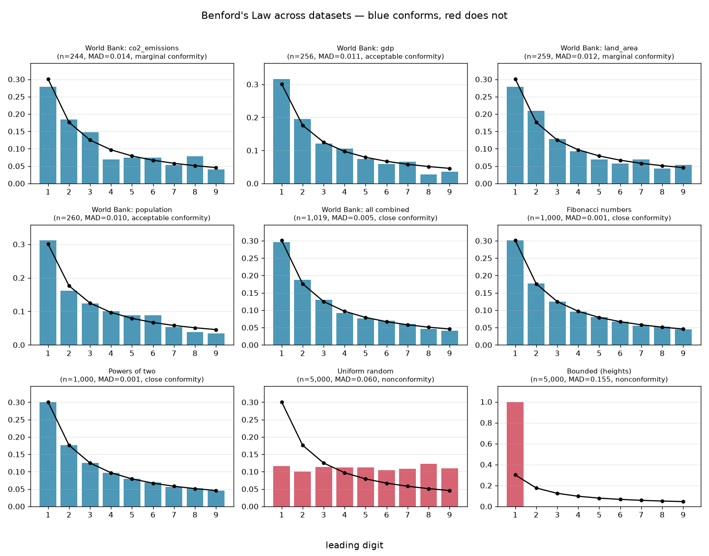

# Benford's Law — the hidden pattern in the first digit

Pick a pile of real-world numbers — the populations of every country, the lengths
of the world's rivers, the market caps of every public company — and look only at
the *first digit* of each. You'd guess each digit 1–9 shows up about a ninth of the
time. It doesn't. **The digit 1 leads about 30% of the time and 9 barely 5%** — a
lopsided pattern called Benford's Law, and it's so reliable that auditors and
election forensics teams use it to sniff out numbers that were made up.

This capstone tests the law across a dozen datasets, asks *why* it holds, and then
asks the harder, more honest question: **how good is it, really, as a lie
detector?**

## The pattern, across very different data



Blue conforms to the Benford curve (the black line), red doesn't. The verdict lines
up with theory in every panel:

```
dataset                        kind                       n     MAD  verdict
World Bank: population          real                     260   0.010  acceptable conformity
World Bank: gdp                 real                     256   0.011  acceptable conformity
World Bank: all combined        real                    1019   0.005  close conformity
Fibonacci numbers               math (should conform)   1000   0.001  close conformity
Powers of two                   math (should conform)   1000   0.001  close conformity
Uniform random                  control (should NOT)    5000   0.060  nonconformity
Bounded (heights)               control (should NOT)    5000   0.155  nonconformity
```

Real economic figures follow it. So do Fibonacci numbers and powers of two, almost
exactly. Uniform random numbers and a bounded quantity (simulated human heights)
flatly don't — and seeing the law *fail* on the right data is what proves the test
has teeth.

## Why does it happen?

Benford's Law is really a statement about **scale**. Data that spans many orders of
magnitude is roughly uniform on a *logarithmic* axis — and on a log axis, the
distance from 1 to 2 (everything starting with a 1) is much wider than the distance
from 9 to 10 (everything starting with a 9). About 30% of the log axis sits under a
leading 1. That's the whole trick, and it explains both the winners and the losers:

- **Populations, GDP, land area** span from thousands to billions — many orders of
  magnitude — so they conform.
- **Human heights** live almost entirely between 150 and 199 cm: barely half an
  order of magnitude. Nearly every value starts with 1, so the leading digit is
  ~100% ones — the opposite of Benford. The chart's most extreme panel.
- **Uniform random** numbers aren't scale-invariant at all, so their first digits
  come out nearly flat.

## The measuring sticks

For each dataset the code reports two standard conformity tests:

- **Chi-square** with a p-value — the classic goodness-of-fit test against the
  Benford proportions.
- **Nigrini's MAD** (mean absolute deviation) — the average gap between observed and
  expected digit proportions, with the conformity bands accountants actually use
  (`<0.006` close, `<0.012` acceptable, `<0.015` marginal, else nonconformity). MAD
  is reported alongside chi-square because chi-square rejects *everything* once the
  sample is large enough — a caveat worth seeing directly.

## Install & run

```bash
pip install -r requirements.txt

# Analyze the datasets that ship with the repo:
python -m benford

# ...or re-download the World Bank figures first (no key needed):
python -m benford --collect
```

## Reading the result honestly

The reason Benford's Law is *interesting* is also the reason it's *dangerous* in
untrained hands:

- **Conformity is not honesty, and nonconformity is not fraud.** Plenty of
  perfectly clean datasets fail Benford for innocent reasons — they're bounded (like
  heights), assigned rather than measured (ZIP codes, invoice numbers with a fixed
  prefix), or simply too small a sample. Using a failed Benford test as proof of
  fraud has led to real, embarrassed retractions, including in election analysis.
- **It needs range and volume.** The law only kicks in for data spanning several
  orders of magnitude, and MAD is noisy for small n. Our per-indicator sets (~250
  countries) sit at "acceptable/marginal"; pooled to ~1,000 values they tighten to
  "close." That movement is the sample size talking, not the world changing.
- **Chi-square gets *more* likely to reject as data grows.** With enough numbers,
  even trivial, meaningless deviations become "significant." That's exactly why the
  forensic-accounting world leans on MAD's fixed bands instead — and why this repo
  shows both.

So Benford is a genuine, beautiful regularity and a useful *screen* — a way to say
"this deserves a closer look" — but never a verdict on its own.

## What's inside

- `law.py` — leading-digit extraction, the Benford probabilities, and the
  chi-square / MAD conformity tests
- `datasets.py` — the test suite: World Bank figures (fetched + cached), the
  mathematical positive controls, and the negative controls
- `plots.py` — the single-dataset chart and the comparison grid
- `cli.py` — the command-line entry point

## Tests

```bash
python -m pytest
```

All 13 tests run offline (no network) against known answers — the Benford
probabilities and their famous 30.1% / 4.6% endpoints, leading-digit extraction
across scale and sign, and the headline behavior: Fibonacci and powers of two must
conform, while uniform noise and a bounded quantity must not.
