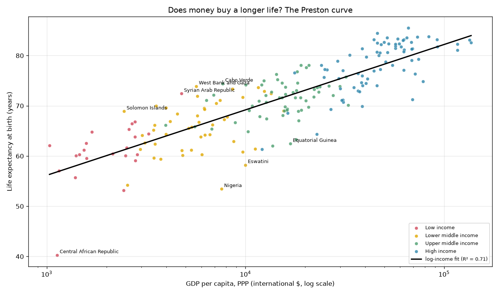
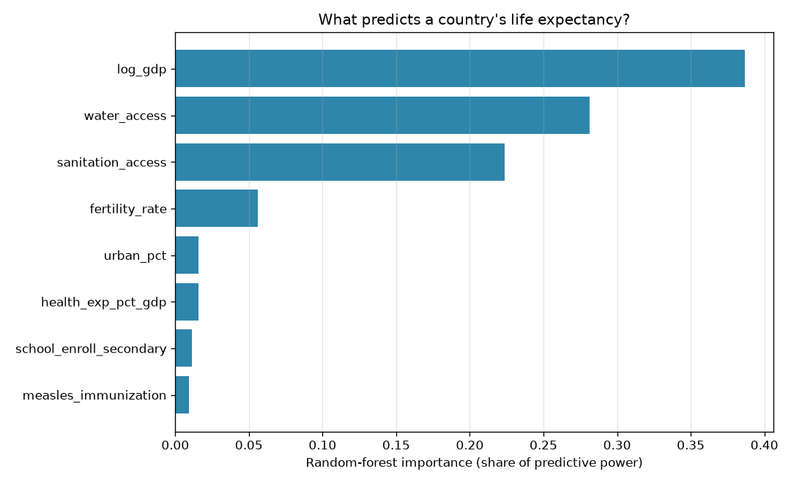
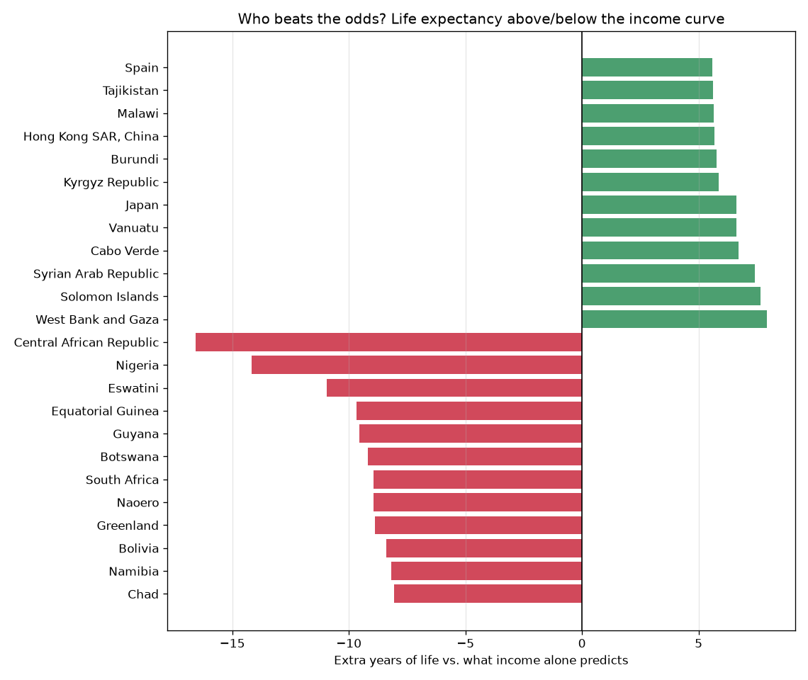

# Life & Money — does wealth buy a longer life?

A person born in the Central African Republic can expect to live to **40**. A person
born in Japan, to **85**. How much of that 45-year gap is simply *money* — and how
much is something a country can change without getting richer?

This capstone uses World Bank data on ~200 countries to answer three questions:

1. **Does income buy life — and how?** It does, but with steep *diminishing
   returns*: the famous **Preston curve**. The first few thousand dollars of income
   buy many years of life; the difference between rich and very rich buys almost
   none.
2. **Beyond income, what matters?** A model predicting life expectancy from eight
   development indicators finds that **clean water and sanitation are nearly as
   powerful as income itself.**
3. **Who beats the odds?** After income has had its say, which countries live *far
   longer* than their wealth predicts — and which fall tragically short?

> **The finding in one line:** money matters enormously for poor countries and
> barely at all for rich ones; and once you account for income, the countries that
> fall short cluster into two heartbreaking, recognizable groups — the HIV/AIDS
> belt of Southern Africa, and oil-rich states whose wealth never reached their
> people.

## 1. The Preston curve



```
Does income buy life linearly, or with diminishing returns?
  Life ~ income        R² = 0.56
  Life ~ log(income)   R² = 0.71   <- log wins: diminishing returns
  Slope: +13.0 years of life per 10x of income
```

Plotted against income directly, the relationship is a sharp curve; against the
*logarithm* of income it straightens into a line (R² jumps from 0.56 to 0.71).
That's the mathematical fingerprint of diminishing returns — going from \$1,000 to
\$10,000 per capita buys about **13 years** of life; going from \$10,000 to
\$100,000 buys the same 13 years, but now you need *ten times the money* for it.

**Avoiding leakage.** The World Bank also publishes infant and child mortality, and
they would "predict" life expectancy almost perfectly — because they are
*arithmetic components* of it. Including them would just be predicting the answer
from itself (the same trap as using forks to predict a repo's stars). Every
predictor kept is a plausible *cause* of longevity, not a restatement of it.

## 2. Beyond income: what predicts a long life?



```
Beyond income, what predicts life expectancy? (out-of-sample)
  Linear model R²:   0.71
  Random forest R²:  0.70
  Top predictors (random forest):
    log_gdp                  38.7%
    water_access             28.1%
    sanitation_access        22.3%
    fertility_rate            5.6%
```

Income leads — but **access to clean water and basic sanitation together carry more
weight than income does.** That's a genuinely hopeful result: these are things a
country can build without first becoming rich, and the data says they buy years of
life. The model is scored *out-of-sample* (on countries held out of training), so
this is predictive skill, not curve-fitting.

## 3. Who beats the odds?



Fit life expectancy from income alone, then look at the **residual** for each
country — actual minus predicted. A positive residual means a country lives longer
than its wealth would suggest; negative means it falls short.

```
Beats the odds (longest life vs. what income predicts):
  West Bank and Gaza    +7.9   Solomon Islands  +7.7   Cabo Verde  +6.7

Falls short:
  Central African Republic  -16.6   Nigeria   -14.2   Eswatini  -11.0
  Equatorial Guinea         -9.7    Guyana    -9.5
```

The "falls short" list is the story. **Eswatini, Botswana, South Africa, and
Namibia** — Southern Africa's HIV/AIDS belt — all sit far below the curve, income
notwithstanding. And **Equatorial Guinea**, one of Africa's highest GDP-per-capita
countries thanks to oil, lives nearly 10 years *below* what that wealth predicts: a
textbook **resource curse**, where money on paper never became health for people.

## Install & run

```bash
pip install -r requirements.txt

# Analyze the dataset that ships with the repo:
python -m life_and_money

# ...or re-download fresh data from the World Bank API first (no key needed):
python -m life_and_money --collect
```

## Reading the result honestly

- **Residuals can reflect mismeasured income, not just health.** Some "beat the
  odds" names — West Bank and Gaza, Syria — have GDP depressed by conflict, which
  lowers their *predicted* life expectancy and inflates the residual. The residual
  is a question ("why is this country off the curve?"), not a verdict.
- **This is a snapshot (~2015–2021), and correlational.** The model finds that
  water, sanitation, and income *travel with* long life; it can't prove any one of
  them *causes* it. Wealthier countries also have better water — the factors are
  entangled, and the model shares credit among them rather than isolating a cause.
- **Missing data is imputed.** Countries missing a predictor keep their place via a
  median fill (roughly 1-in-8 for health spending and schooling); countries missing
  life expectancy or income are dropped. `missing_report` prints the details.

None of these overturn the conclusion; they bound it. Income buys life with sharply
diminishing returns, water and sanitation matter nearly as much, and the countries
that fall furthest short are felled by epidemics and misgoverned wealth.

## What's inside

- `collect.py` — pull nine indicators for every country from the World Bank API,
  keeping each country's most recent value; cache to `data/indicators.csv`
- `features.py` — drop aggregates, log-transform income, impute gaps, exclude the
  mortality-leakage columns
- `model.py` — the Preston (linear-vs-log) fit, the out-of-sample multivariate
  model, and the income-residual ranking
- `plots.py` — the Preston curve, feature importances, and the beats-the-odds chart
- `cli.py` — the command-line entry point

## Tests

```bash
python -m pytest
```

All 11 tests run offline (no network) against synthetic data with a known answer —
that log-income must out-fit raw income, that an engineered over-performer must
surface as a positive residual, that residuals from an OLS fit sum to zero, and
that the mortality-leakage columns can never sneak into the predictor set.
