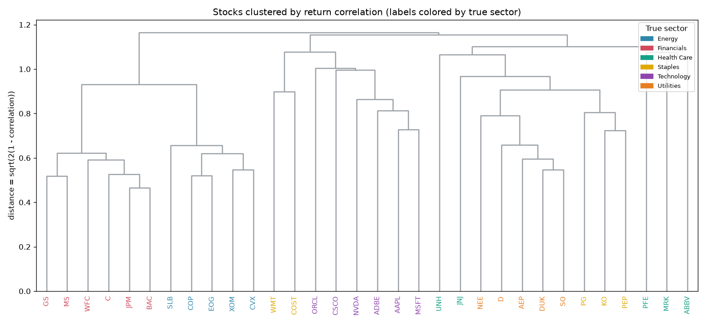
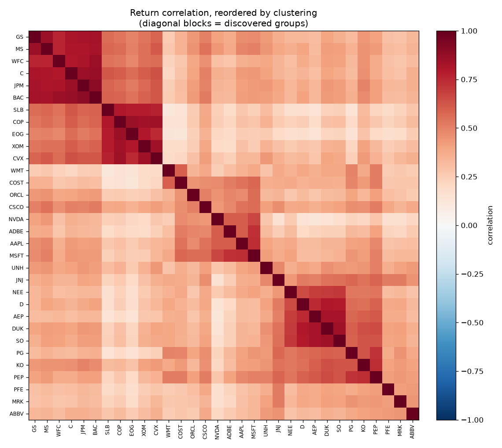

# Market Structure — can an algorithm rediscover the sectors?

Give a clustering algorithm nothing but **daily price movements** — no company
names, no industry labels, no fundamentals — and ask a simple question: does it
carve the market into the same **sectors** a human would? Tech with tech, banks
with banks, utilities with utilities?

This is unsupervised learning on real market data. Stocks that move together are
treated as "close," stocks that move independently as "far"; a hierarchical
clustering builds those distances into a tree, and we cut the tree into groups.
Only at the very end do we unseal the real sector labels and score the match.

> **The finding:** it works — but it finds something arguably *deeper* than the
> official sectors. Financials, Energy, Technology, and Utilities fall out as clean
> groups with no supervision at all. But the algorithm merges banks and oil into
> one **cyclical** super-group, and pools utilities with defensive staples and
> health care into a **defensive** one — because what actually drives stocks to
> move together is *risk factors* (cyclical vs. defensive, rate-sensitive vs. not),
> and those cut right across the tidy sector taxonomy.

On a 32-stock, six-sector universe over 2019–2024 the discovered groups match real
sectors with an **adjusted Rand index of ~0.51** — far above chance (0), clearly
not a coincidence, and honestly short of a perfect 1.0 for a genuine reason, not a
bug.

## The two pictures

| Clustering tree (labels colored by *true* sector) | Correlation, reordered by the clustering |
|---|---|
|  |  |

The heatmap is the "aha": raw, a correlation matrix looks like static. Reordered by
the clustering, correlated names line up into bright blocks down the diagonal — the
Financials block, the Energy block, the Tech block, the Utilities block — structure
that was always there but invisible until sorted.

## Install & run

```bash
pip install -r requirements.txt

# Cluster the built-in labeled universe and score it against real sectors:
python -m market_structure --start 2019-01-01 --end 2024-12-31

# ...or cluster your own tickers (no ground-truth scoring in this mode):
python -m market_structure SPY TLT GLD HYG LQD --k 3
```

Output:

```
Market structure: 32 tickers   (2019-01-02 -> 2024-12-30)
  Clustering on daily-return correlation, k=6, method=average

Agreement with real sectors (never shown to the algorithm):
  Adjusted Rand index:  0.51   (1 = perfect, 0 = chance)
  Purity:               0.69

Discovered clusters vs. true sectors:
cluster      1  2  3  4  5  6
sector
Energy       5  0  0  0  0  0
Financials   6  0  0  0  0  0
Technology   0  0  6  0  0  0
Utilities    0  0  0  5  0  0
...
```

## How it works

1. **Distance** (`cluster.py`) — turn the return-correlation matrix into a true
   metric, `d = sqrt(2(1 - corr))`. Perfectly correlated names sit at distance 0,
   uncorrelated at ~1.41, perfectly anti-correlated at 2. (This is exactly the
   Euclidean distance between the assets' standardized return vectors.)
2. **Cluster** — hierarchical agglomerative clustering (SciPy `linkage`) builds a
   tree; `fcluster` cuts it into `k` groups. Average linkage by default.
3. **Order** — the dendrogram's leaf order is what reindexes the heatmap so the
   blocks appear.
4. **Score** (`evaluate.py`) — unseal the held-back sector labels and compare, with
   two metrics that fail in different ways (see below).

## Reading the score: purity vs. adjusted Rand

- **Purity** assigns each cluster its majority sector and asks what fraction that
  gets right. Intuitive, but it *inflates* as you add clusters — in the limit, one
  cluster per stock scores a perfect 1.0 while telling you nothing.
- **Adjusted Rand index (ARI)** compares the two groupings pair-by-pair and
  subtracts off the agreement you'd expect from random chance. It doesn't reward
  shattering the data into singletons, so it's the honest headline number.

Reporting both — and leaning on ARI — is the point: a single flattering metric is
how analyses lie to themselves.

## Reading the result honestly

- **~0.51 is a real signal, not a perfect map.** The gap from 1.0 isn't the
  algorithm failing; it's the algorithm being right about something the sector
  labels miss. Banks and oil genuinely co-moved through the 2020–2022 cycle;
  utilities and consumer staples genuinely trade as bond-like defensives.
- **Correlation is regime-dependent.** These groupings reflect 2019–2024. In a
  different regime (a tech selloff, an energy shock) the blocks would shift. The
  structure is real but not eternal — a snapshot, not a law.
- **Pharma barely clusters.** PFE, MRK, and ABBV hang off as near-independent
  branches, because drug stocks move on trial and FDA news more than on the market
  factor. The algorithm surfacing that idiosyncrasy is a feature, not noise.

## What's inside

- `universe.py` — a curated 32-ticker, six-sector universe with held-back labels
- `data.py` — fetch and date-align adjusted closes (`yfinance`); daily returns
- `cluster.py` — correlation distance, linkage, tree-cutting, leaf ordering
- `evaluate.py` — purity, adjusted Rand index, contingency and per-ticker tables
- `plots.py` — the dendrogram and the reordered correlation heatmap
- `cli.py` — the command-line entry point

## Use it as a library

```python
from market_structure import (
    load_prices, daily_returns, correlation_distance, cluster_labels, adjusted_rand,
)
from market_structure import universe

prices = load_prices(universe.tickers(), start="2019-01-01")
r = daily_returns(prices)
dist = correlation_distance(r)
labels = cluster_labels(dist, k=universe.n_sectors())
print(adjusted_rand(universe.sectors_for(r.columns), labels.loc[r.columns]))
```

## Tests

```bash
python -m pytest
```

All 11 tests run offline against synthetic returns with a *known* block structure —
groups that share a latent factor must be recovered with perfect purity and an
adjusted Rand index of 1, identical series must sit at distance 0, and pure noise
must score near chance. The scoring helpers are checked against hand-computed
purity and ARI values, including the label-invariance both metrics must satisfy.
