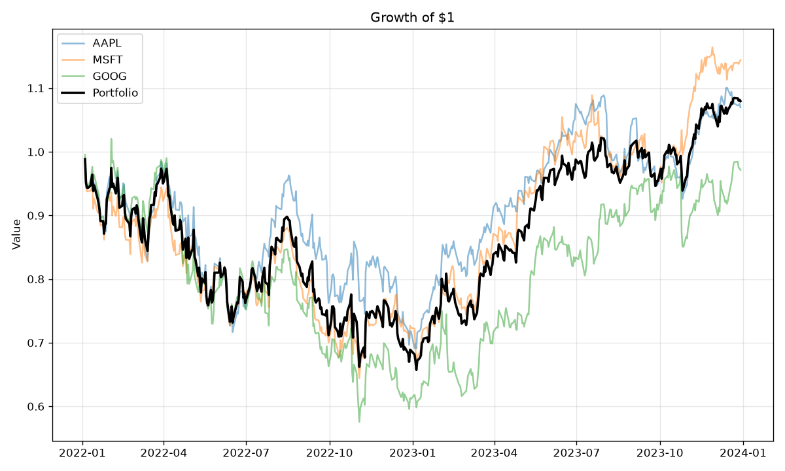
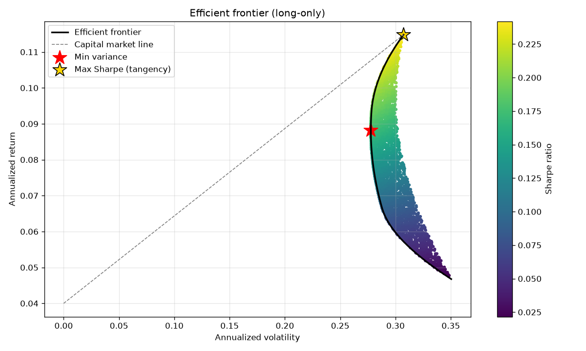
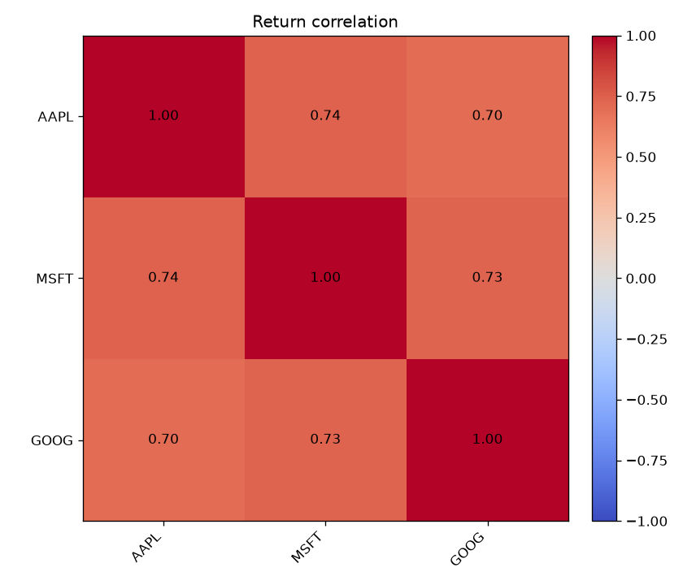

# Portfolio Lab

A Python toolkit for analyzing and optimizing a **multi-asset** stock portfolio.
Give it a basket of tickers and it reports portfolio risk/return, finds the
minimum-variance and maximum-Sharpe portfolios via mean-variance optimization,
and saves charts you can drop straight into a README.

This is the multi-asset follow-up to [`stock-toolkit`](../stock-toolkit), which
analyzes a single ticker.

## Install

```bash
pip install -r requirements.txt
```

## Usage

```bash
python -m portfolio_lab AAPL MSFT GOOG --start 2022-01-01 --end 2024-01-01 --risk-free 0.04
```

Output:

```
Portfolio: AAPL, MSFT, GOOG   (2022-01-03 → 2023-12-29)
  Weights:                 AAPL +33.3%, MSFT +33.3%, GOOG +33.3%
  Annualized return:        7.92%
  Annualized volatility:   28.56%
  Sharpe (rf=4%):             0.14
  Max drawdown:           -33.49%

Optimal portfolios (long-only, optimized):
  Min variance:  ret  8.83%  vol 27.77%  sharpe  0.17
     weights →   AAPL +57.8%, MSFT +36.0%, GOOG +6.2%
  Max Sharpe:    ret 11.48%  vol 30.73%  sharpe  0.24
     weights →   AAPL +0.0%, MSFT +100.0%, GOOG +0.0%
```

By default the optimal portfolios are **long-only** (no shorting, fully invested) —
the realistic case. Pass `--allow-short` to instead use the unconstrained
closed-form solution, which can short and lever up:

```bash
python -m portfolio_lab AAPL MSFT GOOG --allow-short
# Max Sharpe:  weights → AAPL -2.4%, MSFT +255.5%, GOOG -153.2%
```

Pass your own allocation with `--weights` (auto-normalized to sum to 1):

```bash
python -m portfolio_lab AAPL MSFT GOOG --weights 0.5 0.3 0.2
```

## Charts

| Growth of $1 | Efficient frontier | Correlation |
|---|---|---|
|  |  |  |

The frontier plot scatters thousands of random long-only portfolios coloured by
Sharpe ratio, overlays the **true efficient-frontier curve**, and marks the
min-variance and max-Sharpe (tangency) portfolios. The dashed **capital market
line** runs from the risk-free rate through the tangency portfolio.

## The maths

Given annualized expected returns **μ** and the annualized covariance matrix **Σ**,
a portfolio with weights **w** has return `wᵀμ` and volatility `√(wᵀΣw)`.

**Unconstrained (closed form).** Two classic portfolios have exact solutions:

- **Minimum variance:**  `w ∝ Σ⁻¹ 1`
- **Maximum Sharpe (tangency):**  `w ∝ Σ⁻¹ (μ − r_f)`

both normalized so the weights sum to 1, solved directly with `numpy.linalg.solve`.
But these are *unconstrained*: they freely short and lever (weights below 0% or
above 100%), which is why `--allow-short` can put 255% into MSFT. Mathematically
optimal, but not something most people can actually hold.

**Long-only (numerical, the default).** Adding the realistic constraints — no
shorting (`w ≥ 0`) and fully invested (`Σw = 1`) — removes the neat closed form,
so we minimize numerically with SciPy's SLSQP solver (`optimize.py`). The same
machinery traces the efficient frontier by finding the minimum-variance portfolio
for each target return.

## What's inside

- `data.py` — fetch and date-align adjusted closes for many tickers (`yfinance`)
- `portfolio.py` — returns, annualization, correlation, portfolio performance,
  closed-form min-variance & max-Sharpe weights, Monte-Carlo random portfolios,
  max drawdown (pure NumPy)
- `optimize.py` — **constrained** long-only min-variance & max-Sharpe portfolios
  and the efficient-frontier curve (SciPy SLSQP)
- `plots.py` — growth, correlation heatmap, efficient-frontier charts
- `cli.py` — the command-line entry point

## Use it as a library

```python
import numpy as np
from portfolio_lab import load_prices, daily_returns, annualized_mean, annualized_cov, max_sharpe_weights

prices = load_prices(["AAPL", "MSFT", "GOOG"], start="2022-01-01")
r = daily_returns(prices)
w = max_sharpe_weights(annualized_mean(r), annualized_cov(r), risk_free=0.04)
print(dict(zip(prices.columns, np.round(w, 3))))
```

## Tests

```bash
python -m pytest
```

All 16 tests run offline against synthetic series with hand-checked answers — for
example, the min-variance weights of two uncorrelated assets with variances 0.04
and 0.01 must be 20% / 80%, and for two highly-correlated assets where the
*unconstrained* solver would short one of them, the long-only optimizer must
instead land exactly on the no-short boundary.
