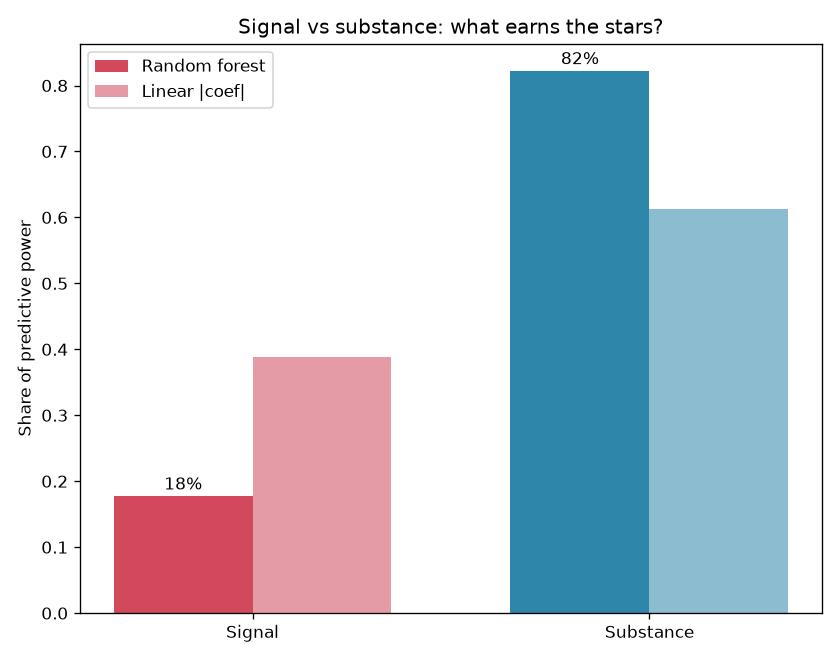
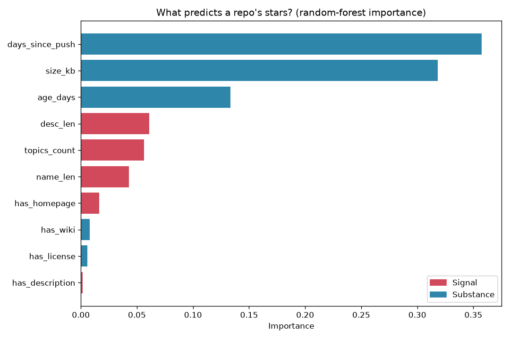
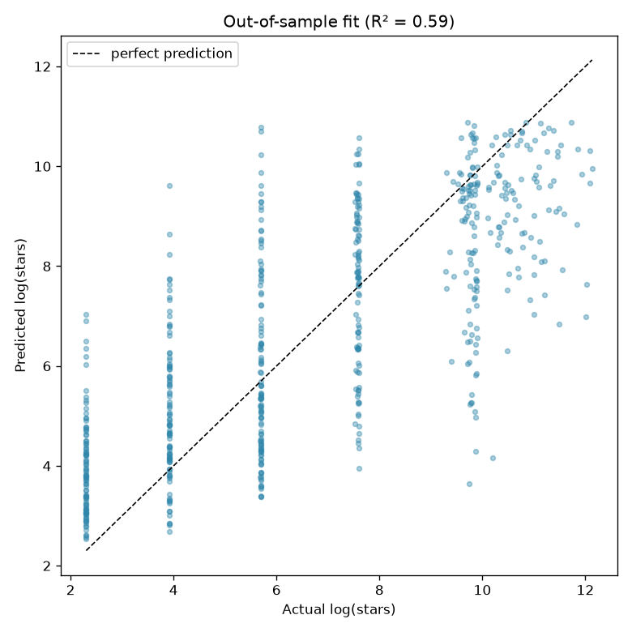

# Star Signals — does GitHub reward substance or surface?

Everyone wants their project to *look good on paper*. This capstone asks whether
that actually works: on GitHub, does a repository's popularity come from **real
substance** (an active, established, sizeable project) or from **surface signal**
(a long description, trendy topic tags, a slick name)?

To find out, I collected a cross-section of 2,400 repositories, split their
features into those two camps, trained a model to predict each repo's star count,
and measured how much of its predictive power comes from each camp.

> **The finding:** substance wins, and it isn't close — roughly **80%** of what
> the model can predict about a repo's stars traces to substance features, versus
> ~20% to surface signal. The single biggest predictor is simply whether the
> project is *still being actively worked on*.

*(Yes, the irony of building this to make my own GitHub look good is not lost on
me. The data's advice turned out to be: do the real work.)*

## The two camps

| Signal (surface polish you curate) | Substance (the actual project) |
|---|---|
| length of the description | how recently it was pushed to (`days_since_push`) |
| number of topic tags | how long it's existed (`age_days`) |
| has a homepage link | code size in KB |
| length of the repo name | has a license / has a wiki |
| has any description at all | |

**Avoiding leakage.** I deliberately excluded `forks` and `open_issues` as
predictors. Both are *consequences* of being popular (popular repos get more forks
and more issues filed), so using them would just be predicting stars from stars.
Every feature kept is visible on the repo page *before* it gets popular.

## Install & run

```bash
pip install -r requirements.txt

# Analyze the dataset that ships with the repo:
python -m star_signals

# ...or re-collect a fresh sample from the GitHub API first
# (uses your `gh` login or a GITHUB_TOKEN env var):
python -m star_signals --collect --per-query 100
```

Output:

```
Star-signals: 2400 repos analyzed
  Stars range: 9 – 451552

Out-of-sample fit (predicting log-stars on unseen repos):
  Linear model R²:     0.52
  Random forest R²:    0.59

Share of predictive power (random forest):
  Substance  82%
  Signal     18%

Top features by importance:
  days_since_push    35.7%   (substance)
  size_kb            31.6%   (substance)
  age_days           13.4%   (substance)
  desc_len            6.0%   (signal)
  ...
Verdict: substance explains 82% of the model's predictive power.
```

## Charts

| Signal vs substance | Feature importances | Out-of-sample fit |
|---|---|---|
|  |  |  |

## How it works

1. **Collect** (`collect.py`) — sample repos across six star buckets (from 1–9
   stars up to 20,000+) and four languages, so the model sees the full range of
   outcomes rather than only winners (that would be survivorship bias).
2. **Features** (`features.py`) — engineer the signal/substance features above and
   take `log(stars)` as the target, since star counts are wildly skewed.
3. **Model** (`model.py`) — a `train_test_split`, then two models scored on the
   **held-out** repos: a standardized linear regression (readable coefficients)
   and a random forest (nonlinear importances). Both are rolled up into the two
   groups for the headline.
4. **Plots** (`plots.py`) — the group split, per-feature importances, and fit.

## Reading the result honestly

- **The two models agree on the winner but not the margin.** The random forest
  puts substance at 82%; the linear model, a more modest 61%. Both point the same
  way — substance dominates — but "80%" is a headline, not a precise constant.
- **R² ≈ 0.59 is real but partial.** Stars are noisy and driven by things we don't
  measure (being featured, a viral tweet, luck). The model finds genuine structure,
  not destiny.
- **`age_days` cuts both ways.** Older repos have simply had more time to gather
  stars, so some of "substance" is really just time. That's an honest limitation,
  not a hidden one.
- **The banding in the fit plot** comes from the bucketed sampling — actual stars
  cluster because we sampled by star range on purpose.

None of these overturn the conclusion; they bound it. A backtest — or a model like
this — is a hypothesis, not a promise.

## Tests

```bash
python -m pytest
```

All 12 tests run offline (no network) against hand-checked feature calculations
and synthetic datasets with a known driver — including a test that flips the true
driver from a substance feature to a signal feature and confirms the model changes
its verdict accordingly.
