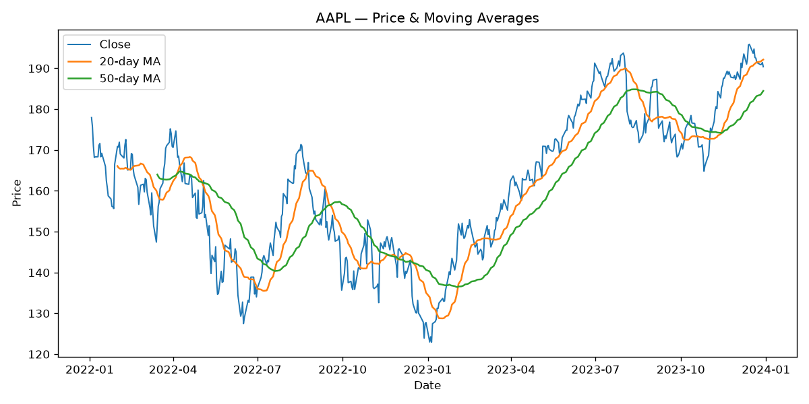

# Stock Data Toolkit

A small, reusable Python toolkit for pulling, analyzing, and visualizing historical
stock data. Give it a ticker and it prints headline risk/return metrics and saves
charts you can drop straight into a README.

## Install

```bash
pip install -r requirements.txt
```

## Usage

```bash
python -m stock_toolkit AAPL --start 2022-01-01 --end 2024-01-01
```

Output:

```
AAPL (2022-01-03 → 2023-12-29)
  Cumulative return:        6.99%
  Annualized volatility:   29.05%
  Max drawdown:           -30.91%

Saved charts:
  assets/price.png
  assets/cumulative.png
```



## What's inside

- `data.py` — fetch clean OHLCV data from Yahoo Finance (`yfinance`)
- `metrics.py` — daily/cumulative returns, annualized volatility, moving averages, max drawdown
- `plots.py` — price + moving-average and cumulative-return charts
- `cli.py` — the command-line entry point

## Use it as a library

```python
from stock_toolkit import load_prices, summary

df = load_prices("MSFT", start="2020-01-01")
print(summary(df["Close"]))
```

## Tests

```bash
python -m pytest
```

Metrics are tested against hand-made series with known answers, so the suite runs
offline with no network access.
