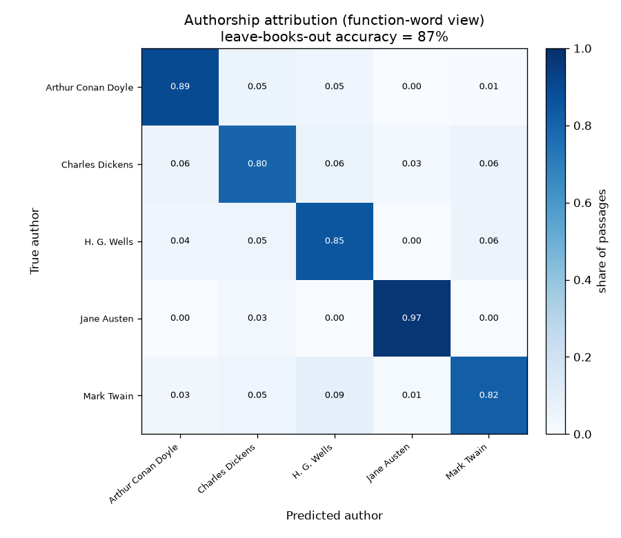
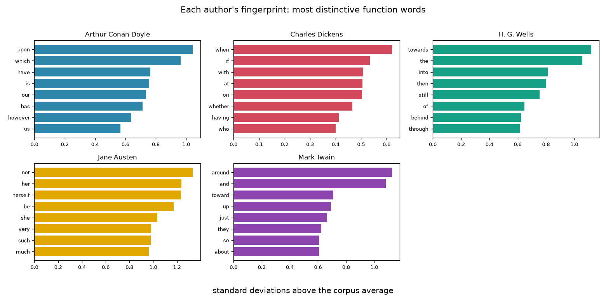
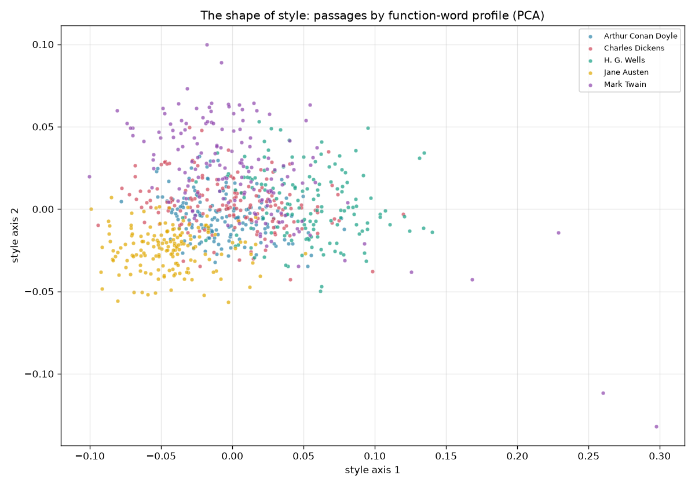

# Word Prints — every writer has a fingerprint

Ask someone what makes an author's style theirs and they'll point to vivid words —
Melville's whales, Austen's drawing rooms. But the real fingerprint is hidden in
the words nobody notices: **the, of, and, upon, that** — the function words that
carry almost no meaning and that a writer sprinkles through every sentence out of
pure habit. This capstone shows you can name the author of a passage from those
tiny words *alone*, with every content word stripped away.

This is **stylometry** — the same idea that let statisticians settle the disputed
authorship of the Federalist Papers in the 1960s. Here it runs on 20 public-domain
novels by five authors, cut into ~780 passages.

> **The finding:** a classifier that sees *only* function-word frequencies — no
> nouns, no verbs, no topic — identifies the author of a passage from a book it has
> never seen **87%** of the time (chance is 20%). Stripping away all the content
> words doesn't *hurt* accuracy; it slightly *helps* it (82% → 87%), because content
> tempts the model to recognize the *subject* instead of the *style*.

## The honest part: split by book, not by passage

The single choice that makes this trustworthy is the train/test split. If you split
passages at random, chunks of the *same book* land in both training and testing,
and the model can win by memorizing that book's characters and places — topic
leakage wearing a disguise. So the model is scored **leave-one-book-out**: every
passage of a held-out book is tested by a model trained only on the author's *other*
books. To score, a fingerprint has to survive into a work the model never opened.



Jane Austen is identified 97% of the time; even the hardest author clears 80%. The
mistakes are few and unsystematic.

## What the fingerprints look like



Ranked by *distinctiveness* (standard deviations above the corpus average), each
author's tell-tale function words are strikingly readable — and sometimes historical:

- **H. G. Wells** leans on **"towards"** and **"into"**; **Mark Twain** on
  **"toward"** and **"around"** — the British/American spelling split, captured
  automatically from raw text.
- **Arthur Conan Doyle** overuses the archaic **"upon"**; **Jane Austen**, the
  reflexive **"herself"**.

## The shape of style



Projecting every passage from its ~170-dimensional function-word profile down to two
dimensions (PCA), the authors separate into recognizable neighborhoods — Austen off
in her own corner, Wells and Twain pulling to opposite sides — even though the axes
were built with no knowledge of who wrote what.

## Install & run

```bash
pip install -r requirements.txt

# Analyze the corpus that ships with the repo:
python -m word_prints

# ...or re-download and re-chunk the books from Project Gutenberg first:
python -m word_prints --collect
```

## How it works

1. **Corpus** (`corpus.py`) — download 20 novels from Project Gutenberg, strip the
   license boilerplate, and cut each into fixed-length word passages (dropping a
   short remainder so every passage is the same length). Cached to
   `data/chunks.csv.gz`.
2. **Features** (`features.py`) — two views of each passage: the relative
   frequencies of ~170 **function words** (content-free style), and an ordinary
   TF-IDF over the **full vocabulary** (content included), for comparison.
3. **Model** (`model.py`) — logistic regression, scored **leave-one-book-out** via
   `GroupKFold` on the book id. Function-word features are standardized within each
   training fold (the Burrows-style move that makes rare markers like "upon" count
   as much as "the").
4. **Plots** (`plots.py`) — the confusion matrix, the per-author signatures, and the
   PCA style map.

## Reading the result honestly

- **Function words beat full vocabulary *because* of the honest split.** Under
  leave-books-out, content words mostly encode *topic*, which doesn't carry from one
  of an author's books to another; function-word habits do. Split passages at random
  instead and full-vocabulary would look better — by cheating on topic. The gap is a
  lesson about evaluation, not just about style.
- **Five famous authors is a friendly setting.** These voices are distinctive and
  the books are long. Real authorship disputes (ghostwriting, collaboration, short
  texts) are far harder; 87% here is not 87% everywhere.
- **Translations would muddy this.** Every author here wrote in English, so the
  fingerprint is theirs. Run it on translated works and you would partly be
  fingerprinting the *translator*.

## Tests

```bash
python -m pytest
```

All 13 tests run offline (no network) against synthetic corpora with a known answer.
Two carry the argument: authors who genuinely differ in function-word usage must be
recovered far above chance, while authors who differ only in *topic* must stay near
chance under the function-word view — proving the representation truly discards
content instead of smuggling it back in.
